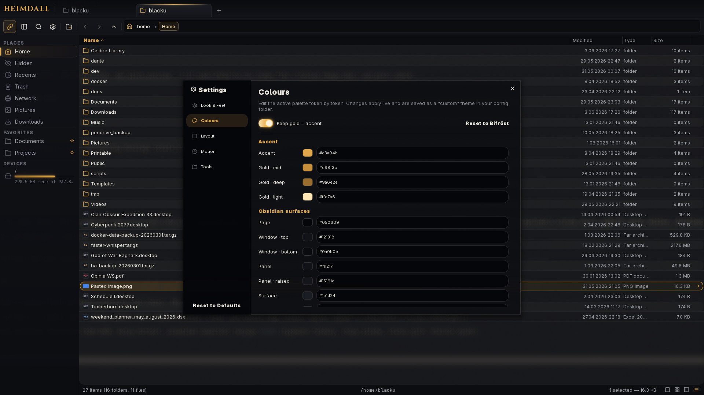

<div align="center">


# Wayfile

**An obsidian-and-gold file manager for Hyprland and Wayland — fast, keyboard-driven, and deeply themeable.**

[](LICENSE)
[](https://github.com/blackbartblues/Wayfile/releases)
[](https://aur.archlinux.org/packages/wayfile-git)

</div>

> **Wayfile is a fork of [HyprFM](https://github.com/soyeb-jim285/hyprfm)** by Soyeb Pervez Jim — re-skinned with the obsidian + gold *Bifröst* theme and extended with a hybrid view, merged tabs, and an in-app palette editor. The fork lands **167 commits** on top of HyprFM — 64 features, **41 bug fixes**, 38 refactors and perf work — squashing a long tail of bugs and hardening the app for the 1.0.0 release. All credit for the original file manager goes to the upstream project.

---

Wayfile is a Qt6/QML file manager built to feel native on Hyprland: lightweight, fast, and unapologetically keyboard-driven. Its signature look is **Bifröst** — a deep obsidian surface with a warm gate-glow gold accent — and its default layout is the **hybrid view**, a folder grid stacked over a sortable file list with one shared selection. Underneath the polish sit the features power users actually reach for: Miller columns, split panes, merged tabs, async file operations, rich previews, git status, and a live TOML theme system with a built-in, granular palette editor.

<div align="center">


*The default **hybrid** view — a folder grid over a sortable file list, themed sidebar with a live disk meter, and the obsidian + gold Bifröst skin.*

</div>

---

## ✨ Features

### Views

- **Hybrid** (default) — a folder grid stacked over a sortable file list, with one unified selection across both halves; the file list sorts independently.
- **Grid** (`Ctrl+1`) — `Ctrl+Scroll` to zoom; the icon size stays constant while columns reflow to fill the width.
- **Detailed** (`Ctrl+3`) — sortable `Name · Modified · Type · Size` columns, folder item counts, image/video thumbnails.
- **Miller columns** (`Ctrl+2`) — parent · current · live preview, with a metadata panel for the focused item.
- **Quick preview** (`Space`) — a full-screen overlay for images, video, PDFs, and text with a rich metadata sidebar; `←/→` browse neighbours.
- **Split panes** (`F3`) — up to four directories side by side, each with its own path strip and item count.

<div align="center">


*Grid view — gold folder glyphs, metallic file-type chips, and inline thumbnails.*


*Miller columns with a live preview column and per-item metadata.*

</div>

### Navigation & input

- **Full keyboard navigation** — arrows, history, type-ahead jump-to-file
- **Tabs** with independent per-pane history; **merge tabs** into a split "supertab" (the merge button joins the active tab with its right-hand neighbour)
- **Breadcrumb path bar** with inline editing (`Ctrl+L`) and suggestions
- **Bookmarks sidebar** with drag-to-reorder, typed-folder emblems, and udisks2 device mounting with live capacity meters
- **Kinetic wheel scrolling** with momentum and rubber-band overscroll
- **Rubber-band selection**; contiguous selections render as one rounded outline

### File operations

- **Async copy / move** via `rsync` and `gio` with live progress, speed, ETA, and pause
- **Drag & drop** between panes, tabs, and external apps (Wayland-native)
- **Trash** with restore (XDG-compliant) · **Bulk rename** with regex find/replace
- **Compress / extract** archives · **Open With** from `.desktop` entries · **Undo / redo**

<div align="center">


*Quick preview (`Space`) — image preview with a full metadata sidebar and EXIF hints.*

</div>

### Look & feel

- **Bifröst**, the signature obsidian + gold theme, plus bundled Catppuccin Mocha & Latte
- **In-app palette editor** — a granular *Colours* settings page edits the live theme token by token (swatch + hex), saves it as a writable `custom` theme, and warns on low accent contrast
- **TOML themes with live reload** — drop a file in `themes/`, pick it in Settings, no restart
- **Built-in SVG icon set** (Lucide-style, rendered via Qt Shapes) and the *Cinzel* / *JetBrains Mono* type pairing
- **Configurable** corner radius, fonts, animation timing, transparency
- **Compositor blur** on Hyprland, plus native KWin blur on KDE Plasma

<div align="center">


*The built-in Colours editor — edit the active palette token by token; it saves as a live "custom" theme.*

</div>

### Integrations

- **udisks2** mount/unmount of removable drives · **gvfs / gio** for SFTP, SMB, MTP, trash
- **Git status overlays** in every view (modified, staged, untracked, …)
- **wl-clipboard** clipboard · **bat** syntax highlighting · **ffmpeg** video posters · **Poppler** PDF previews

---

## 📦 Installation

### Arch Linux (AUR)

```bash
yay -S wayfile-git
```

The PKGBUILD clones the latest `main`, builds with Ninja, and installs to `/usr/bin/wayfile`.

### Build from source

```bash
git clone --recursive https://github.com/blackbartblues/Wayfile.git
cd Wayfile
cmake -B build -G Ninja -DCMAKE_BUILD_TYPE=Release -DBUILD_TESTS=OFF
cmake --build build --parallel
./build/src/wayfile
```

> **Note:** `--recursive` pulls the [quill-icons](https://github.com/soyeb-jim285/quill-icons) icon submodule. (The Quill control library is vendored directly in `src/qml/Quill/`, so it is not a submodule.)

#### Dependencies

| | Packages |
|---|---|
| **Required (build)** | `cmake`, `ninja`, `qt6-base`, `qt6-declarative`, `qt6-svg` |
| **Required (runtime)** | `qt6-base`, `qt6-declarative`, `qt6-svg`, `qt6-wayland`, `glib2`, `fd`, `rsync`, `xdg-utils` |
| **Optional** | `kwindowsystem` (native KDE blur), `wl-clipboard` (clipboard), `bat` (syntax highlighting), `gvfs` / `gvfs-smb` (remote filesystems), `ffmpeg` (video thumbnails), `udisks2` (device mounting), `poppler-qt6` (PDF previews) |

---

## ⌨️ Keyboard shortcuts

### Navigation
| Shortcut | Action |
|----------|--------|
| `Return` / `Double-click` | Open file or directory |
| `Backspace` / `Alt+Up` | Parent directory |
| `Alt+Left` / `Alt+Right` | Back / Forward in history |
| `Ctrl+L` | Focus path bar |
| `Ctrl+F` | Search |
| `Type any letter` | Type-ahead jump to file |

### Views
| Shortcut | Action |
|----------|--------|
| `Ctrl+1` | Grid view |
| `Ctrl+2` | Miller column view |
| `Ctrl+3` | Detailed view |
| `Ctrl+Scroll` | Zoom |
| `Space` | Quick preview |
| `F3` | Toggle split pane |
| `F9` | Toggle sidebar |
| `Ctrl+H` | Toggle hidden files |

> The **hybrid** view is the default and is reachable from the view switcher in the status bar.

### Tabs
| Shortcut | Action |
|----------|--------|
| `Ctrl+T` / `Ctrl+W` | New / Close tab |
| `Ctrl+Shift+T` | Reopen closed tab |
| `Ctrl+Tab` / `Ctrl+Shift+Tab` | Cycle tabs |

### File operations
| Shortcut | Action |
|----------|--------|
| `Ctrl+C` / `Ctrl+X` / `Ctrl+V` | Copy / Cut / Paste |
| `Ctrl+A` | Select all |
| `Ctrl+Z` / `Ctrl+Shift+Z` | Undo / Redo |
| `F2` | Rename |
| `Delete` / `Shift+Delete` | Trash / Permanent delete |
| `Ctrl+Shift+N` / `Ctrl+N` | New folder / New file |

All shortcuts can be remapped in `~/.config/wayfile/config.toml` under `[shortcuts]`.

---

## ⚙️ Configuration

Config lives at `~/.config/wayfile/config.toml`, created with sensible defaults on first run.

```toml
[general]
theme = "bifrost"              # filename in themes/ without .toml ("custom" = your edited palette)
icon_theme = "Wayfile"        # system icon theme fallback
builtin_icons = true           # use the bundled SVG icons
default_view = "hybrid"        # hybrid | grid | detailed | miller
show_hidden = false
sort_by = "name"               # name | size | modified | type
sort_ascending = true

[sidebar]
position = "left"
width = 236
visible = true

[appearance]
radius_small = 4
radius_medium = 8
radius_large = 12
transparency_enabled = true
transparency_level = 1.0

[bookmarks]
paths = ["~/Documents", "~/Downloads", "~/Pictures", "~/Projects"]

[shortcuts]
# Override any shortcut, e.g.:
# rename      = "F2"
# miller_view = "Ctrl+2"
```

---

## 🎨 Theming

A theme is a TOML file with a single `[colors]` table. Drop one in `themes/` (or your config folder) and pick it in **Settings → Look & Feel → Theme** — it applies live, no restart. Almost the entire UI is token-driven, so a complete theme recolours the whole app.

There are two token families. The **semantic** layer drives dialogs, menus, and every control:

```toml
[colors]
base = "#111217"; mantle = "#0c0d11"; crust = "#050609"; surface = "#1b1d24"; overlay = "#22242c"
text = "#ECE7DC"; subtext = "#9CA0A8"; muted = "#62666e"
accent = "#E3A94B"; success = "#7ab87a"; warning = "#c9956a"; error = "#c97070"
```

The **obsidian + gold** layer drives the signature chrome (tabs, toolbar, sidebar, breadcrumb, views, badges) and the atmosphere (sheens, shadows, scrim):

```toml
gold = "#E3A94B"; goldMid = "#C98F3C"; goldDeep = "#9a6e2e"; goldLight = "#FFE7B6"
page = "#050609"; bgA = "#121318"; bgB = "#0a0b0e"
panel = "#111217"; panel2 = "#15161c"; raise = "#1b1d24"; raise2 = "#22242c"
line = "#25262e"; lineSoft = "#1b1c22"; hair = "#0e0f13"
sheen = "#FFF0D6"; shadowInk = "#000000"; scrim = "#C7080A0D"; goldInk = "#1a1206"; knob = "#FFF3DF"
```

> Keep `accent` and `gold` equal (or deliberately compatible) — the chrome reads `gold` while controls read `accent`, and Bifröst unifies them by making the two identical.

**Don't want to hand-edit TOML?** The **Colours** settings page edits the live palette token by token (swatch + hex field), saves it to a writable `~/.config/wayfile/custom.toml`, and selects it as the `custom` theme. A "Reset to Bifröst" button reverts, and a live warning flags an accent that's too low-contrast against the background.

The shipped `themes/catppuccin-mocha.toml` and `themes/catppuccin-latte.toml` are the best templates for mapping a foreign palette onto both token families.

---

## 🧱 Architecture

Wayfile is a three-layer Qt6 application:

- **QML frontend** (`src/qml/`) — all rendering. `Main.qml` wires tab state, selection, and shortcuts. `FileViewContainer` switches between `HybridView`, `FileGridView`, `FileDetailedView`, and `FileMillerView`. Theme tokens come from the `Theme` / `Fonts` / `FileTypeColors` / `GitColors` QML singletons; the vendored [Quill](https://github.com/soyeb-jim285/quill) library (in `src/qml/Quill/`) provides themed controls, bridged onto Wayfile's tokens in `Main.qml`.
- **C++ backend** (`src/models/`, `src/services/`, `src/providers/`) — `QAbstractListModel` subclasses for files, tabs, bookmarks, devices; async services for config, theming, clipboard, file operations, search, disk usage, and previews. `ThemeLoader` parses the active TOML into the live `Theme` singleton. Exposed to QML via `setContextProperty`.
- **System layer** — `rsync` / `gio` via `QProcess`, UDisks2 over DBus, `wl-copy` for the clipboard.

See [`CLAUDE.md`](CLAUDE.md) for the full architecture notes.

---

## 🤝 Contributing

Issues and PRs welcome. A few notes:

- Run the tests with `ctest --test-dir build` after changes (Qt6::Test).
- Match the existing 4-space-indent style for QML and C++.
- Initialise submodules after pulling: `git submodule update --init --recursive`.

---

## 📜 License & credits

[MIT](LICENSE). Wayfile is a fork maintained by **blackbartblues**, building on the original **[HyprFM](https://github.com/soyeb-jim285/hyprfm)** by **Soyeb Pervez Jim**.

Built with [Qt 6](https://www.qt.io/) · icons from [Lucide](https://lucide.dev/) · type by [Cinzel](https://github.com/NDISCOVER/Cinzel) & [JetBrains Mono](https://www.jetbrains.com/lp/mono/) · inspired by macOS Finder, Nautilus, and Dolphin.
